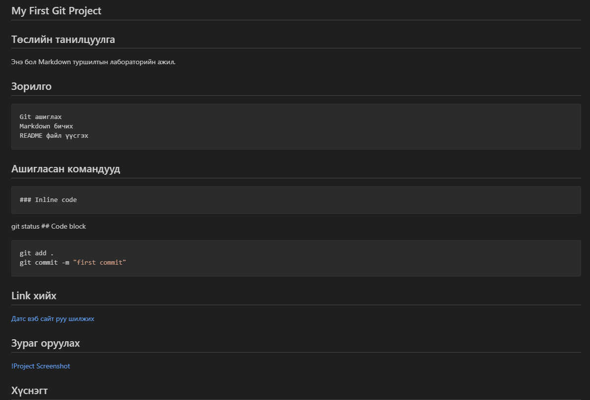

## My First Git Project

## Төслийн танилцуулга

Энэ бол Markdown туршилтын лабораторийн ажил.

## Зорилго

    Git ашиглах
    Markdown бичих
    README файл үүсгэх
## Ашигласан командууд
    ### Inline code
git status
    ## Code block
```bash
git add .
git commit -m "first commit"
```
## Link хийх
[Датс вэб сайт руу шилжих](http://stda.edu.mn/)
## Зураг оруулах

## Хүснэгт
| нэр |нас|мэргэжил|
|Бат  |20 |IT      |
|болд |22 |SE      |